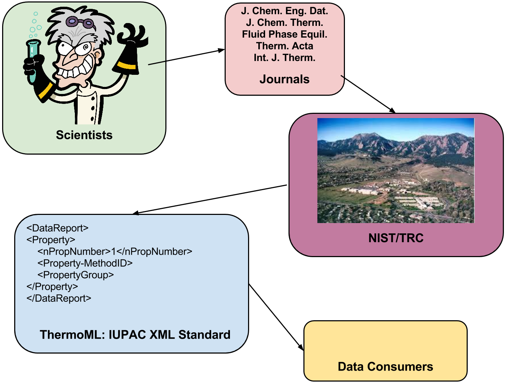

% title: Benchmarking Small Molecule Forcefields at the Scale of NIST
% author: Kyle A. Beauchamp, Choderalab@MSKCC
% author: Slides here: goo.gl/rKGhzZ
% favicon: figures/membrane.png

---
title: Goal: Predictive atomistic models
subtitle: Kinase inhibitor affinity, specificity, and properties

<video id="sampleMovie" class="center" src="movies/shaw-dasatanib-2.mov" loop=\"true\ autoPlay=\"true\  width="512" height="384"></video>

<footer class="source"> Shan et al: J. Am. Chem. Soc. (2011). <a href="http://dx.doi.org/10.1021/ja202726y">DOI</a>. </footer>

---
title: Expensive models, complex forcefields

---
title: Molecular dynamics is (finally) fast
subtitle: A \$999 GPU buys 128 ns / day on solvated proteins

<footer class="source"> 
GTX Titan, DHFR, OpenMM 6.2 (openmm.org) See also: Gromacs, AMBER, Charmm, NAMD, DESMOND, ACEMD
</footer>

---
title: Forcefields: Are we there yet?
subtitle: Water and protein: getting better

<footer class="source"> 
Lindorff-Larsen, PLOS One, 2012.  
</footer>

---
title: Small molecule forcefields need work

<footer class="source"> 
Fennell, Mobley.  J. Phys. Chem. B. 2014
</footer>

---
title: Data access is killing forcefields

- Forcefields should be consistent with all available data
- Most datasets are heterogeneous, offline, and static

<footer class="source"> 
See also work by Wang, Pande, Swope, Case, MacKerell, Ponder, Best, Hummer, Bruschweiler.
</footer>

---
title: WANTED: Reliable, machine-readable, open archive of physicochemical measurements!
class: segue dark nobackground

---
title: NIST Thermodynamics Research Center

---
title: Data Capture at NIST/TRC: ThermoML

---
title: ThermoML is rapidly growing

<footer class="source"> 
Figure from Chiraco, J. Chem. Eng. Dat., 2013.
</footer>

---
title: Can we leverage ThermoML for forcefield validation?
class: segue dark nobackground

---
title: Density and dielectric constants as forcefield tests

- Sensitive to nonbonded parameters
- Simple ensemble average geometric interpretation

$$\rho = \langle \frac{M}{V} \rangle$$

$$\epsilon = 1 + \frac{4\pi}{3} \frac{\langle \mu \cdot \mu \rangle - \langle \mu \rangle \cdot \langle \mu \rangle}{V k_B T}$$

<footer class="source"> 
See also van der Spoel, JCTC, 2011 and Fennell, 2012.
</footer>

---
title: How many measurements are there?
subtitle: Munging the ThermoML with pyxb and pandas

---
title: Benchmarking neat liquid densities and dielectric constants

- OpenMM 6.2
- GAFF + AM1-BCC (Antechamber + OpenEye)
- Converge each density to 0.0002 g / mL ($\approx$ expt. error)

<footer class="source"> 
PME + Langevin 1 fs + Monte Carlo Barostat + Fixed HBond Constraints + 1000 molecules per box
</footer>

---
title:  Densities are in the ballpark

---
title: Inverse dielectric constant is proportional to interaction strength

$$U(r) = \frac{1}{4 \pi \epsilon} \frac{q_1 q_2}{r} \propto \frac{1}{\epsilon}$$

---
title:  Static dielectric constants are consistently underestimated

---
title: Fixed charges fail to capture polarizability
subtitle: Observed: $\epsilon \approx 2.0$, Predicted: $\epsilon \approx 1.0$, $\Delta \Delta G \approx$ 2 kcal / mol

---
title: Atom counting predicts molecular polarizability to within 2%

$$\alpha = 1.53 n_C + 0.17 n_H + 0.57 n_O + 1.05 n_N + 2.99 n_S + \\ 2.48 n_P + 0.22 n_F + 2.16 n_{Cl} + 0.32 $$

$$\epsilon_{corrected} = \epsilon_{MD} + 4 \pi N  \frac{\alpha}{\langle V \rangle}$$

<footer class="source"> 
Sales, 2002
</footer>
---
title: Empirical atomic polarizability corrections reduce bias

---
title: Where do we go from here?

- Scale up, real-time simulation, web frontend
- Perform new experiments in automated wetlab
- Bayesian forcefield design
- Polarizable forcefields

---
title: Conclusions

- Small molecule forcefields need help
- ThermoML is a NIST-supported, machine-readable, and growing set of physicochemical data
- We built a semi-automated benchmark of densities and dielectric constants in ThermoML
- Empirical polarizability model improves comparisons to measured dielectric constants

---
title: Funding and Acknowledgments

- Julie Behr (MSKCC)
- Patrick Grinaway (MSKCC)
- Bas Rustenburg (MSKCC)
- John Chodera (MSKCC)
- Kenneth Kroenlein (NIST)

<footer class="source"> 
Also Vijay Pande, Lee-Ping Wang, Peter Eastman, Robert McGibbon, Jason Swails, David Mobley, Christopher Bayly, Michael Shirts, and the Chodera lab. 
</footer>
